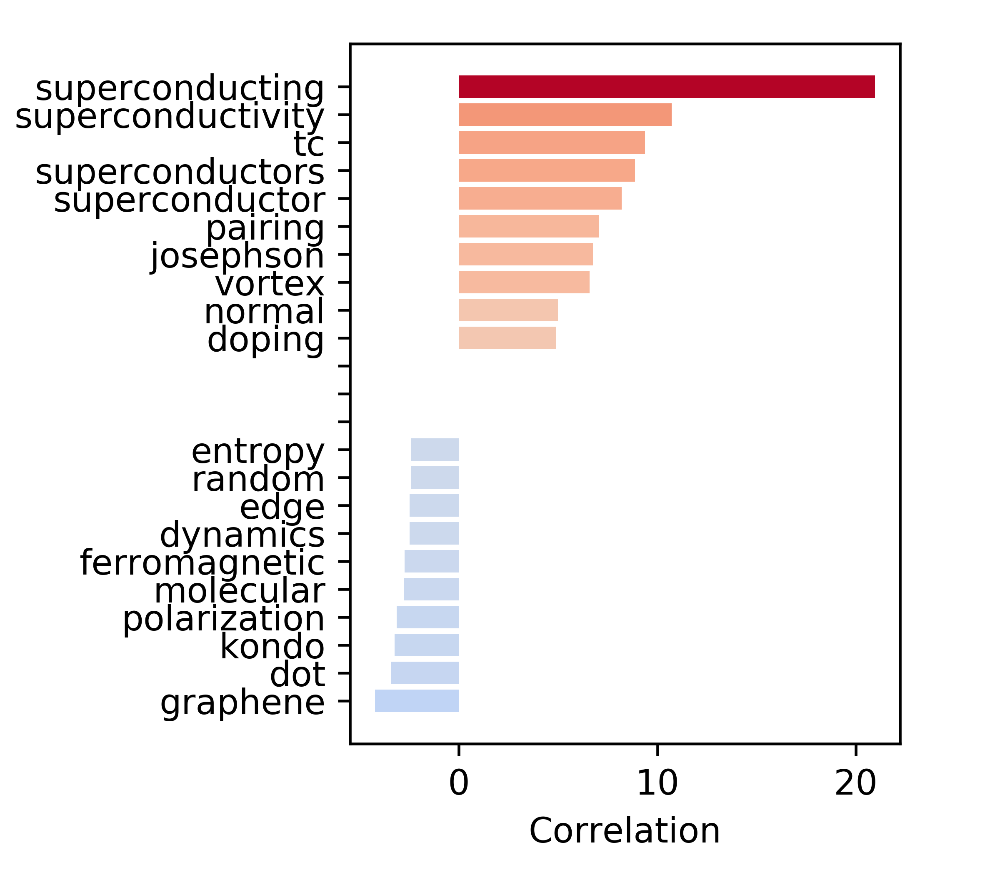

# arXivData
Analysis of arXiv paper abstracts

## Description
The [arXiv](https://arxiv.org/) is the most important publishing source for many fields. Its open access, and non-peer reviewed structure make that many papers appear on the arXiv while being in the process of peer review. One problem this carries with it is the enormous amount of information that is available. Over the last twenty or so years, over 250000 articles have been published in the sub-category of the field I do my PhD in (condensed matter, or “[cond-mat](https://arxiv.org/archive/cond-mat)”). The volume of information makes it critical that entries are labelled appropriately. As an additional help to digest the information, a recommendation system that suggests particular articles to users based on their interest would be helpful. These two things are precisely what this project attempts to do. As a matter of fact, this project was spawned by the frustration the author had browsing through the 100 or so new articles every morning, and figured there should be a better way. This project then, attempts to make a robust classifier, to sub-subcategorize the articles within cond-mat, based on the contents of their abstract. This would be able to suggest labels to users at the point of submission, based on the abstract they provide. Furthermore, the features in the classifier can be used as a representation for the abstract, in order to recommend articles based on similarity.

## Overview and quick results
The project uses various classifiers: it implements latent sematic analysis, gradient boosted models, and convolutional neural networks. The current best implementation (using a convolutional neural network) attains a sensitivity of 74.4 % with a precission of 68.8 %.

The single layer LSA model can be used to extract information about how terms correlate with a particular category. As an example, below are terms that correlate (or anti-correlate) strongly with the subcategory “cond-mat.supr-con” (condensed matter – superconductivity):

The various forms of “superconductivity” should come as no surprise as the strongest correlators. Someone familiar with the field will recognize the other terms like “Tc” and “pairing”. Two mentions from the anti-correlations: graphene has a strong anti-correlation with superconductivity, this might change in the future regarding the recent discovery of superconductivity in [magic angle graphene](https://www.nature.com/articles/nature26160). Furthermore, superconductivity is a state that does not allow the existence of ferromagnetism (except in a few exceptions), so the word “ferromagnetic” captures the physics nicely.

A more robust overview of the (in progress) analysis will soon follow.

## Overview of files
* **scrape_arxiv.py**: code to download the arxiv dataset using their API
* **split_train_test.py**: split the training and test set
* **data_preprocessing.py**: functions used for cleaning the data
* **data_stats.py**: initial analysis of the data (lenghts, number of categories, etc)
* **correlations.py**: initial analysis of the correlations between words and classes
* **lsamodel.py**: model containing the LSA classifier and script to train
* **postanalysis.py**: analyze the performance of the trained model and extract correlations
* **lgbm_model.py**: model containing the lgbm classifier and script to train
* **make_embedding.py**: script to generate word2vec type embeddings used for the CNN classifier
* **cnn_model.py**: model containing the CNN classifier and script to train
* **recommender.py**: basic functions for the recommender

## Wishlist/to do list
1. Expand the recommendation system
3. Expand to other Arxiv subsections

## Team Members
* Berend Zwartsenberg, University of British Columbia
